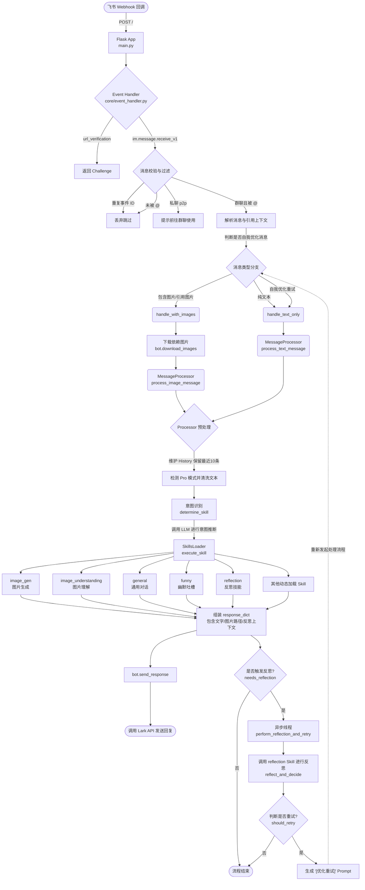

# ZBJ Agent 完整消息处理流程

本文档梳理了当前 Agent (`zbj`) 从接收到用户消息，到解析、意图识别、Skill 路由执行，再到响应返回及反思重试的完整生命周期。

## 核心流程图

## 流程详细说明

1. **接入与路由 (Entry & Routing)**
   - 外部请求通过 `main.py` 的 Flask 应用进入，触发 `callback_event_handler`。
   - `core/event_handler.py` 注册了 `im.message.receive_v1` 事件处理消息。

2. **预处理与过滤 (Preprocessing & Filtering)**
   - **去重**：使用 `processed_events` 集合记录并跳过重复推送的 Event ID。
   - **聊天类型限制**：拦截 `p2p` 私聊，提示用户去群聊中 `@` 机器人。
   - **上下文解析**：提取消息文本，并通过 `get_quoted_message_info` 等方法，识别并提取被引用的历史图片和文本。

3. **消息分发机制 (Bot Handlers)**
   - `core/bot.py` 根据内容分为 `handle_text_only` 和 `handle_with_images` 两种处理链路。
   - 若包含图片，系统会自动调用 Lark API 下载相关图片并保存在本地。
   - 这两类链路最终均交由 `llm/processor.py` 中的 `MessageProcessor` 处理。

4. **意图识别与技能加载 (Intent & Skills)**
   - **Pro 模式检测**：过滤消息中的 "Pro模式"、"高清" 等关键词，打上 `use_pro=True` 标记。
   - **意图识别 (`determine_skill`)**：
     - 完全移除硬编码的关键词匹配，直接组装可用 Skills 的 `summary` 信息，调用大模型（LLM）去推断最合适的 Skill Name，以提供更智能、准确的意图判断。
   - **技能动态加载 (`SkillsLoader`)**：根据识别出的 Skill，动态寻找 `skills/{skill_name}/scripts/main.py` 并执行其 `execute` 方法。

5. **响应反馈 (Response)**
   - 各个 Skill 执行完毕后返回标准化的字典结构（如包含 `text`, `image_path`）。
   - `bot.py` 中的 `send_response` 负责将文字和生成的图片（若有）通过 Lark API 发送给用户。

6. **反思与自优化闭环 (Reflection & Auto-Retry)**
   - 针对复杂的图像生成或图像修改，Skill 可以返回 `needs_reflection=True` 及 `reflection_context`。
   - 此时会拉起一个后台独立线程 `perform_reflection_and_retry`，触发名为 `reflection` 的独立技能。
   - 反思模块会判断本次执行是否符合预期。如果需要优化，它会生成带有 `[优化重试]` 前缀的优化 Prompt，并直接在代码层面发起新一轮处理（回到步骤3），从而实现机器人的“自我重试修正”循环。
